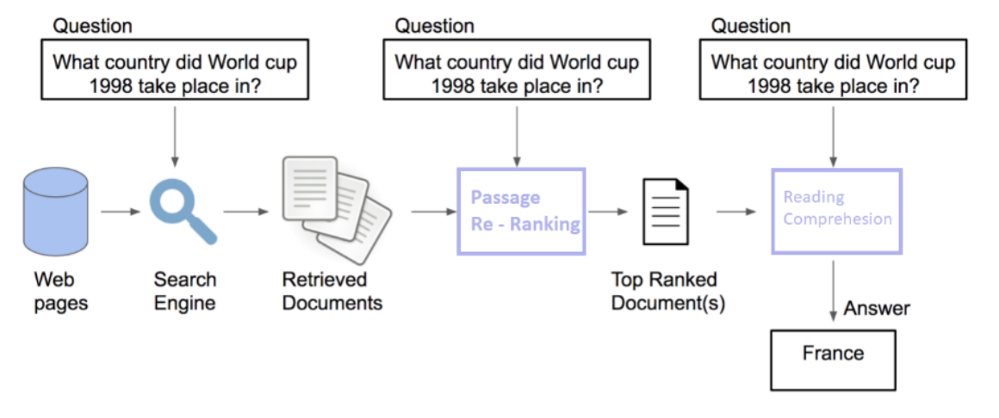
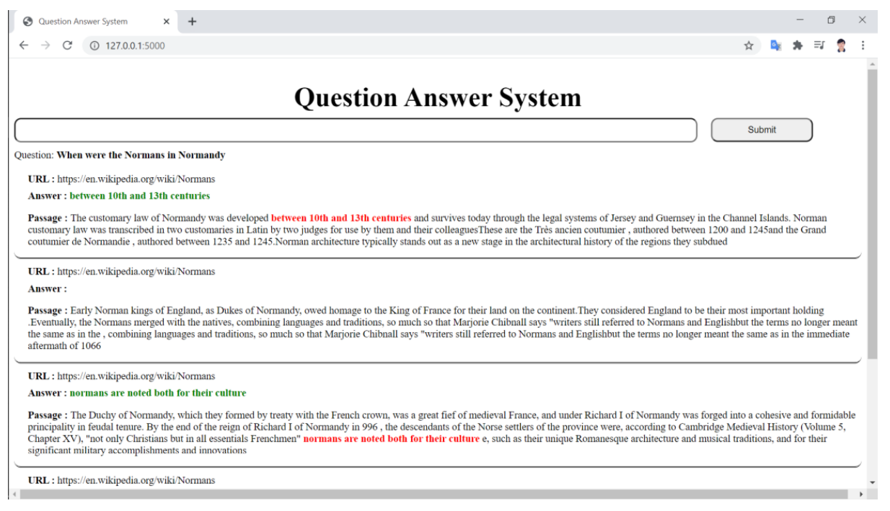

# Question Answer System

## Install
```
conda env create -f ODQA.yml
```

## activate environment
```
conda activate ODQA
```

## Pipeline



## Information Retrieval - (Re-ranking passage)

Use Quesntion encoder and Passage encoder model of [Dense Passage Retrieval](https://github.com/facebookresearch/DPR) which is trained on multi data. Then, use dot-product to perform similarity of embeddings.

### Download pretrained model DSP

```
python Retrieval/download_pretrained.py
```

## Reader (Reading Comprehension)

### Download SQuAD v2 dataset

```
python download_data.py
```
### Fine tune ELECTRA on SQuAD v2

#### Download pretrained ELECTRA model
```
python Reader/download_pretrained.py
```
#### Training

```
python Reader/train.py
```

### Result
| Epoch   | Loss   | Exact Match |
| ------- |:------:| :----------:|
| ​1 | 1.1731 | 0.83 |
| 2 | 0.7471 | 0.84 |
| 3 | 0.6016 | 0.85 |

# Demo

```
python app.py
```
## UI

